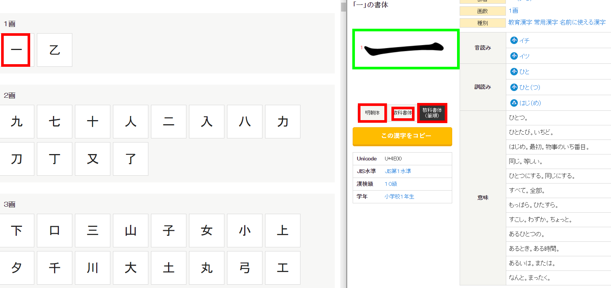

Purpose
==========

Get the image from the website: https://kanji.jitenon.jp/cat/joyo.html

How to use it
=================

1. run the `get_target_url` -> output: target.csv
#. run `get_img_url_from_target_url` -> get_img_url_from_target_url.csv
#. run `download_image_from_url`

done!